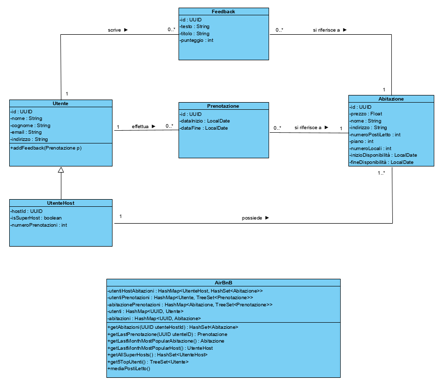

# Requisiti
Un facoltoso turista americano ci ha chiesto di creare una piattaforma ispirata ad un famoso sito per affittare
case vacanza. Tutti possono registrarsi alla piattaforma e, se approvati come host, caricare una o più abitazioni
e specificare un prezzo, un periodo (data di inizio e data di fine) durante il quale l'abitazione è 
prenotabile da altri utenti. Ogni abitazione ha id, nome, indirizzo, numero di locali, numero di posti letto e piano.
Ogni utente ha nome cognome, email, indirizzo e ogni host ha un codice host. In più, un super-host è tale 
se ha ricevuto, da quando si è registrato, almeno 100 prenotazioni. 
Di ogni prenotazione si deve mantenere un id univoco, le date di inizio e fine, l'abitazione relativa e l'utente che
ha soggiornato. Ogni utente che ha soggiornato presso un abitazione può lasciare un feedback al proprietario
dell'abitazione. Ogni feedback ha un id, un titolo, un testo e un punteggio (da 1 a 5).
Deve essere possibile effettuare le seguenti operazioni nel sistema:

- ottenere le abitazioni corrispondente ad un certo codice host
- ottenere l'ultima prenotazione dato un id utente  
- ottenere l'abitazione più gettonata nell'ultimo mese
- ottenere gli host con più prenotazioni nell'ultimo mese
- ottenere tutti i super-host  
- ottenere i 5 utenti con più giorni prenotati nell'ultimo mese
- ottenere il numero medio di posti letto calcolato in base a tutte le abitazioni caricate dagli host

Per le date e i periodi potete utilizzare java.time.LocalDateTime e java.time.Duration
esempio:

`
Period.between(aDate, sixtyDaysBehind);
`

Nota: gestite tutto con le collection, nessun database (per ora!)

# Diagramma delle classi

